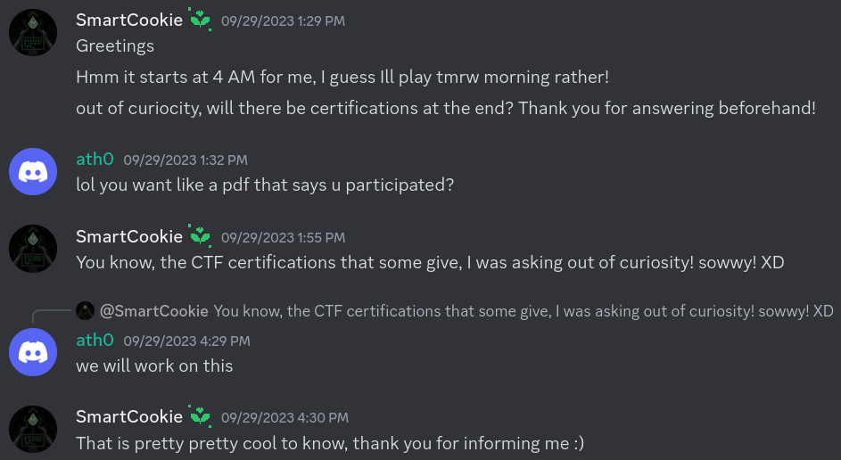

mbund


# Certs



## Running

```
openssl genpkey -algorithm RSA -out private_key.pem
openssl rsa -in private_key.pem -pubout -out public_key.pem
docker compose up
```

Then access [http://localhost:3001](http://localhost:3001) in your browser.
